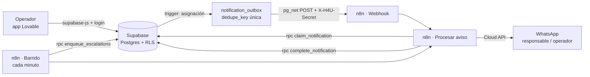

# n8n_implementation

MVP de gestión de incidencias de mantenimiento para propiedades en Airbnb
(technical challenge de Remote Hire 4U). **Lovable** para la app del operador,
**Supabase** para datos y reglas, y **n8n** (self-hosted con Docker, imagen oficial de
[n8n-io/n8n](https://github.com/n8n-io/n8n)) para avisar por WhatsApp al responsable
y escalar al operador cuando nadie responde.

## Arquitectura



**Decisiones y por qué**

| Decisión | A favor | En contra |
|---|---|---|
| Reglas en triggers de Postgres, no en el frontend | Cualquier cliente (Lovable, n8n, SQL) respeta lo mismo; Lovable solo muestra el error | La lógica queda en SQL, menos visible para quien solo ve la app |
| Patrón *outbox* con `dedupe_key` única | Idempotente: el mismo evento nunca manda dos WhatsApp; nada se pierde si n8n está caído | Una tabla y tres RPC más que un webhook directo |
| Webhook (rápido) + barrido cada minuto (red de seguridad) | Tiempo real cuando todo funciona; reintento automático cuando el túnel cambia o Meta falla | Hasta ~1 min de retraso en el peor caso |
| n8n solo ve lo que devuelve `claim_notification()` | El aviso **nunca** incluye el contacto del huésped | Si se quiere otro dato en el mensaje hay que tocar la función |
| Secretos en Vault (Supabase) y en credenciales cifradas (n8n) | Nada sensible en el repo ni en `.env` del frontend | Un paso manual de configuración por cada secreto |
| Operadores con login (RLS para `authenticated`, nada para `anon`) | Los datos de huéspedes no quedan expuestos con la anon key pública | Hay que crear usuarios para el demo |

## Estructura

```
docker-compose.yml          n8n 2.43.1 + Postgres propio + túnel Cloudflare (perfil "tunnel")
.env.example                configuración no secreta del contenedor
supabase/migrations/        esquema, reglas, historial, vista "requiere atención", outbox y RPC
supabase/seed.sql           4 propiedades, 5 responsables, 8 incidencias (no dispara avisos)
n8n/workflows/              los 3 workflows exportados (fuente de verdad)
scripts/n8n-bootstrap.sh    importa y publica workflows; crea credenciales de relleno
docs/                       WhatsApp, prompts de Lovable, pruebas
```

## Puesta en marcha

### 1. Supabase
1. SQL Editor → ejecutar en orden `supabase/migrations/*.sql` y después `supabase/seed.sql`.
2. Authentication → Users → crear el usuario del operador (correo + contraseña).
3. Poner el teléfono (formato `5219981234567`) a los responsables que van a recibir avisos:
   `update assignees set phone = '52...' where name = 'Carlos Ruiz';`
4. Después de levantar el túnel (paso 2), registrar el webhook en Vault:
   ```sql
   select vault.create_secret('https://<tunel>.trycloudflare.com/webhook/h4u-aviso', 'n8n_webhook_url');
   select vault.create_secret('<mismo valor que la credencial "Secreto del webhook">', 'n8n_webhook_secret');
   ```
   Si la URL del túnel cambia: `select vault.update_secret((select id from vault.secrets where name = 'n8n_webhook_url'), '<nueva url>');`
   Mientras no esté configurado, los avisos igual salen con el barrido de cada minuto.

### 2. n8n
```bash
cp .env.example .env            # llenar; N8N_DB_PASSWORD y N8N_ENCRYPTION_KEY con: openssl rand -hex 32
docker compose --profile tunnel up -d
docker compose logs tunnel | grep -o 'https://[a-z0-9-]*\.trycloudflare\.com'
# poner esa URL (con / final) en N8N_PUBLIC_URL de .env y:
docker compose up -d n8n
./scripts/n8n-bootstrap.sh
```
En http://localhost:5678 → crear la cuenta de owner → **Credentials** → reemplazar `REEMPLAZAR` en:

| Credencial | Valor |
|---|---|
| H4U · Supabase service_role | Host = URL del proyecto; Service Role Secret = Project Settings → API Keys → pestaña **Legacy API keys** → `service_role` (la JWT `eyJ...`; con la nueva `sb_secret_...` no está probado) |
| H4U · Secreto del webhook | `openssl rand -hex 32` (el mismo va a Vault como `n8n_webhook_secret`) |
| H4U · Token WhatsApp Cloud API | `Bearer <token>` de la app de Meta (ver [docs/whatsapp.md](docs/whatsapp.md)) |

### 3. Lovable
Seguir [docs/lovable_prompts.md](docs/lovable_prompts.md): la app se conecta al proyecto de
Supabase existente y **no** crea tablas.

## Cómo se probó
Ver [docs/pruebas.md](docs/pruebas.md): las migraciones y los workflows se probaron de punta a
punta en local (Postgres + PostgREST como sustituto de la API de Supabase + mock de la
WhatsApp Cloud API).
