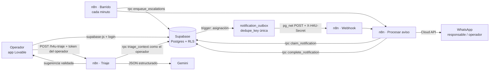

# n8n_implementation

MVP de gestión de incidencias de mantenimiento para propiedades en Airbnb
(technical challenge de Remote Hire 4U). **Lovable** para la app del operador,
**Supabase** para datos y reglas, y **n8n** (self-hosted con Docker, imagen oficial de
[n8n-io/n8n](https://github.com/n8n-io/n8n)) para avisar por WhatsApp al responsable
y escalar al operador cuando nadie responde, y para sugerir el triaje con **Gemini**.

**En producción:** app en https://h4u-supa-connect.lovable.app · n8n en una VM de Google Cloud
con HTTPS (`https://35-197-28-59.sslip.io`, solo webhooks públicos) · ver [deploy/gcp](deploy/gcp/README.md).

## Arquitectura



**Decisiones y por qué**

| Decisión | A favor | En contra |
|---|---|---|
| Reglas en triggers de Postgres, no en el frontend | Cualquier cliente (Lovable, n8n, SQL) respeta lo mismo; Lovable solo muestra el error | La lógica queda en SQL, menos visible para quien solo ve la app |
| Patrón *outbox* con `dedupe_key` única | Idempotente: el mismo evento nunca manda dos WhatsApp; nada se pierde si n8n está caído | Una tabla y tres RPC más que un webhook directo |
| Webhook (rápido) + barrido cada minuto (red de seguridad) | Tiempo real cuando todo funciona; reintento automático cuando el túnel cambia o Meta falla | Hasta ~1 min de retraso en el peor caso |
| n8n solo ve lo que devuelve `claim_notification()` | El aviso **nunca** incluye el contacto del huésped | Si se quiere otro dato en el mensaje hay que tocar la función |
| Secretos en Vault (Supabase) y en credenciales cifradas (n8n) | Nada sensible en el repo ni en `.env` del frontend | Un paso manual de configuración por cada secreto |
| Operadores con login (RLS para `authenticated`, nada para `anon`) | Los datos de huéspedes no quedan expuestos con la anon key pública | Hay que crear usuarios para el demo |
| Triaje: n8n valida el token del operador contra Supabase antes de llamar a Gemini | El webhook público no se puede usar sin sesión; ningún secreto en Lovable | Una llamada extra a Supabase por sugerencia |
| Guardas después del modelo (catálogo, palabras de riesgo, duplicados, confianza) | La IA sugiere, pero no puede asignar fuera del catálogo ni bajar una emergencia | Las palabras de riesgo son una lista fija que hay que mantener |
| URL de n8n en `app_config` (Supabase), no en el código del front | Cambiar de túnel a la VM, o de VM, no requiere redeploy del front | Una lectura extra a Supabase por sugerencia |
| n8n en una VM con Caddy (no Cloud Run) | Mismo docker-compose probado en local; el barrido de cada minuto necesita un proceso siempre vivo; HTTPS y URL fija | Hay que mantener la VM (parches, respaldos) |

## Estructura

```
docker-compose.yml          n8n 2.43.1 + Postgres propio + túnel Cloudflare (perfil "tunnel")
docker-compose.gcp.yml      en la VM: agrega Caddy (HTTPS automático, solo /webhook/* público)
deploy/gcp/                 Caddyfile, instalar.sh y la guía de despliegue en Google Cloud
.env.example                configuración no secreta del contenedor
supabase/migrations/        esquema, reglas, historial, vista "requiere atención", outbox y RPC
supabase/seed.sql           4 propiedades, 5 responsables, 8 incidencias (no dispara avisos)
n8n/workflows/              los 4 workflows exportados (fuente de verdad)
scripts/correr_migraciones.sh  aplica migraciones pendientes una sola vez (+ seed opcional)
scripts/n8n-bootstrap.sh    importa y publica workflows; crea credenciales de relleno
scripts/actualizar_tunel.sh apunta Supabase (Vault + app_config) a la URL de n8n (túnel o --url fija)
scripts/empaquetar_n8n.sh   arma el paquete para migrar n8n (con sus credenciales) a la VM
scripts/prueba_e2e.sh       prueba de punta a punta contra el ambiente real (24 verificaciones)
docs/                       WhatsApp, prompts de Lovable, pruebas
```

## Puesta en marcha

### 1. Supabase
1. Migraciones y datos de ejemplo (requiere Docker; corre `psql` en contenedor):
   ```bash
   ./scripts/correr_migraciones.sh --estado   # qué está aplicado y qué falta
   ./scripts/correr_migraciones.sh --seed     # aplica lo pendiente y carga el seed si la base está vacía
   ```
   Usa `SUPABASE_DB_URL` de `.env` (Connect → **Session pooler**) o la pide sin eco.
   Volver a correrlo es seguro: lo aplicado se salta, cada migración es atómica, el seed no se
   duplica, y si alguien edita una migración ya aplicada se detiene sin tocar nada.
   Para cambiar el esquema: **archivo nuevo** `supabase/migrations/<AAAAMMDDHHMMSS>_<nombre>.sql`.
2. Authentication → Users → crear el usuario del operador (correo + contraseña).
3. Poner el teléfono (formato `5219981234567`) a los responsables que van a recibir avisos:
   `update assignees set phone = '52...' where name = 'Carlos Ruiz';`
4. Después de levantar el túnel (paso 2), registrar el webhook en Vault:
   ```sql
   select vault.create_secret('https://<tunel>.trycloudflare.com/webhook/h4u-aviso', 'n8n_webhook_url');
   select vault.create_secret('<mismo valor que la credencial "Secreto del webhook">', 'n8n_webhook_secret');
   ```
   Si la URL del túnel cambia, o Cloudflare lo da de baja ("Tunnel not found"; los túneles
   de trycloudflare son efímeros): `./scripts/actualizar_tunel.sh`. Reinicia el túnel y propaga
   la URL nueva a `.env`, a Vault y a `app_config.n8n_url`, de donde el frontend la lee
   (no hace falta tocar ni redeployar el front).
   Mientras no esté configurado, los avisos igual salen con el barrido de cada minuto.

### 2. n8n
```bash
cp .env.example .env            # llenar; N8N_DB_PASSWORD y N8N_ENCRYPTION_KEY con: openssl rand -hex 32
docker compose --profile tunnel up -d
docker compose logs tunnel | grep -o 'https://[a-z0-9-]*\.trycloudflare\.com'
# poner esa URL (con / final) en N8N_PUBLIC_URL de .env y:
docker compose up -d n8n
./scripts/n8n-bootstrap.sh
```
En http://localhost:5678 → crear la cuenta de owner → **Credentials** → reemplazar `REEMPLAZAR` en:

| Credencial | Valor |
|---|---|
| H4U · Supabase service_role | Host = URL del proyecto; Service Role Secret = Project Settings → API Keys → llave secreta `sb_secret_...` (verificado; la legacy `service_role` también sirve). **No** la `sb_publishable_...`: con esa el barrido falla con "Invalid API key" |
| H4U · Secreto del webhook | `openssl rand -hex 32` (el mismo va a Vault como `n8n_webhook_secret`) |
| H4U · Token WhatsApp Cloud API | `Bearer <token>` de la app de Meta (ver [docs/whatsapp.md](docs/whatsapp.md)) |
| H4U · API key de Gemini | Google AI Studio / proyecto `hire-4u` → API key |

### 3. Lovable
Seguir [docs/lovable_prompts.md](docs/lovable_prompts.md): la app se conecta al proyecto de
Supabase existente y **no** crea tablas.

## Cómo se probó
Ver [docs/pruebas.md](docs/pruebas.md): las migraciones y los workflows se probaron de punta a
punta en local (Postgres + PostgREST como sustituto de la API de Supabase + mock de la
WhatsApp Cloud API).
